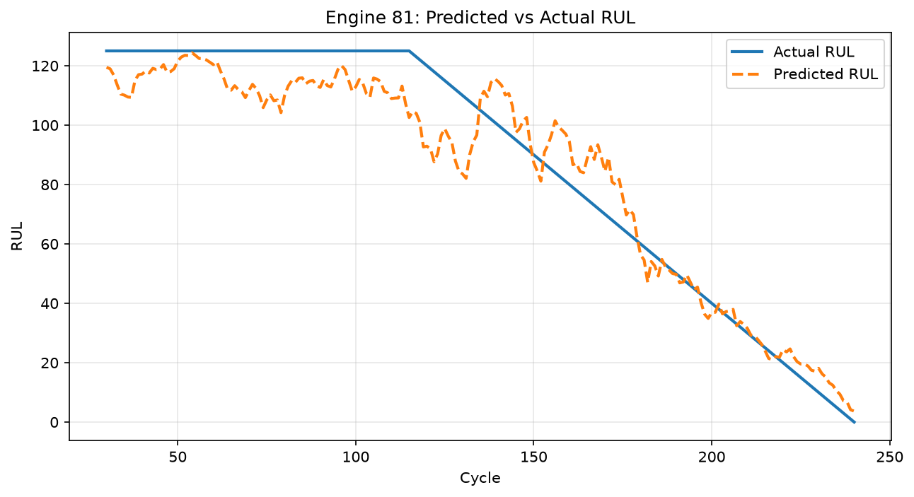
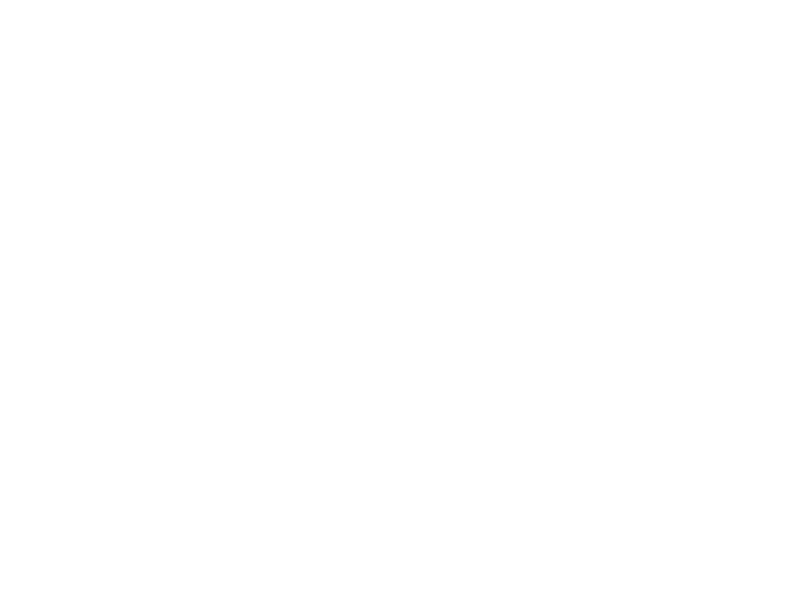
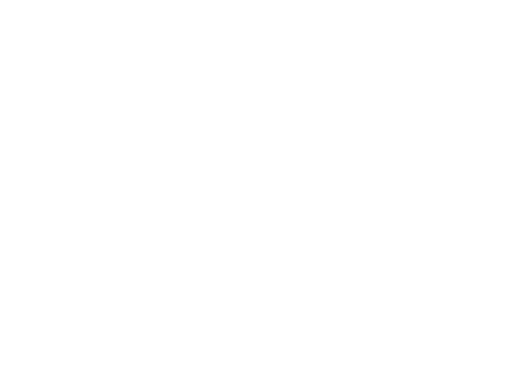

# Turbofan Engine Remaining Useful Life (RUL) Prediction

Predicting how many operating cycles remain before a jet engine fails, using NASA's C-MAPSS simulated turbofan sensor data and an LSTM neural network.

## Project overview

NASA's C-MAPSS dataset simulates turbofan jet engines run to failure, recording 21 sensor channels and 3 operational settings across each engine's full operating life. This is a classic **predictive maintenance** problem: given an engine's recent sensor history, predict its Remaining Useful Life (RUL) — the number of cycles left before it fails.

This project uses the **FD001** subset (single operating condition, single fault mode — the simplest of the four C-MAPSS subsets) and an **LSTM (Long Short-Term Memory) neural network**, since RUL prediction depends on the *pattern* of sensor degradation over time, not any single reading in isolation.

## Data & approach

- **Source:** NASA C-MAPSS FD001 (100 training engines, 100 test engines, run to failure)
- **Preprocessing:**
  - Dropped 6 sensors with constant/near-zero variance across all engines (uninformative for prediction)
  - Scaled remaining features with `MinMaxScaler` (0-1 range) rather than `StandardScaler`, since LSTM internal gates use bounded activations (tanh/sigmoid) that pair better with a fixed, bounded input range
- **Sequence construction:** built sliding windows of 30 consecutive cycles per engine (shape: `[samples, 30, 18]`), since a single cycle's readings don't reveal a degradation trend — the model needs to see a short history to learn one. Windows are never built across two different engines.
- **Train/validation split:** split **by engine ID** (80 engines train, 20 validation), not by individual sequence. Random sequence-level shuffling would leak near-duplicate, heavily overlapping windows from the same engine across both sets, inflating validation performance and hiding the model's true ability to generalize to a genuinely unseen engine.
- **RUL capping:** raw RUL labels (which range from 0 to 300+) were capped at 125 cycles. Uncapped, MSE-based training over-weights precision on high-RUL (early-life, operationally low-stakes) predictions, since squared error scales with the raw magnitude of the label. Capping removes that distortion and lets the model focus its capacity on the near-failure region, where prediction accuracy actually matters for maintenance decisions.

## Model architecture

```
LSTM(64, return_sequences=True) → LSTM(32) → Dense(16, relu) → Dense(1)
```

- Two stacked LSTM layers: the first layer returns a full sequence (`return_sequences=True`) so the second LSTM layer has a sequence to process; the second layer returns only a final summary vector, since the Dense layers after it need a single fixed-size vector, not a sequence.
- Trained with `EarlyStopping` (`patience=5`, `restore_best_weights=True`), which monitors validation loss and rolls back to the best-performing epoch rather than the last one — important given the tendency for validation loss to fluctuate epoch to epoch on a relatively small (20-engine) validation set.
- **Dropout was tested and deliberately excluded.** Both a heavy (0.2/0.2/0.3) and a light (0.2) dropout configuration were tried; both *underperformed* the no-dropout model, indicating the model — at ~34K parameters — was already small enough, and the mild overfitting signal observed was already being handled adequately by early stopping. This was a data-driven decision, not an oversight.

## Results

| Metric | Value |
|---|---|
| MAE (validation) | **9.14 cycles** |
| R² (validation) | **0.9051** |

For context, an MAE of ~9 cycles means the model's RUL prediction is, on average, off by about 9 operating cycles — and an R² of 0.905 means the model explains roughly 90% of the variance in RUL across validation engines it never trained on.

### Predicted vs. actual RUL (sample engines)

Below: predicted RUL (orange, dashed) vs. actual RUL (blue) over an engine's full recorded life. The flat plateau at 125 reflects the RUL cap; the decline reflects the true countdown to failure.





## Known limitations

- **Noisy predictions during the healthy (flat-125) region.** Across all sampled engines, predicted RUL oscillates rather than sitting flat during early life, even though the model correctly recognizes the engine is far from failure. This doesn't affect maintenance decisions in practice (the model still correctly signals "plenty of runway"), but it's a source of noise the model hasn't fully learned to suppress.
- **Inconsistent behavior near failure across engines.** One validation engine (81) showed the model overestimating RUL by ~15-20 cycles in its final cycles — the operationally riskiest kind of error, since it could lead to a maintenance decision that assumes more time remains than actually exists. Two other engines (85, 95) did not show this pattern and converged tightly with actual RUL near failure. This suggests the issue is engine-specific rather than systemic, but it's worth further investigation across the full validation set before treating this model as production-ready.
- Validation set is small (20 engines), so epoch-to-epoch validation metrics are noisier than they would be with a larger held-out set.

## How to run

```bash
python -m venv venv
source venv/bin/activate  # or venv\Scripts\activate on Windows
pip install pandas numpy matplotlib seaborn scikit-learn tensorflow jupyter

# Download FD001 files (train_FD001.txt, test_FD001.txt) from Kaggle:
# "NASA Turbofan Jet Engine Data Set" / "CMAPSS Jet Engine Simulated Data"
# and place them in this project directory.

jupyter notebook
```

Run the notebook cells in order: data loading → cleaning → normalization → sequence construction → train/validation split → model training → evaluation → visualization.

## Tech stack

Python, pandas, NumPy, scikit-learn, TensorFlow/Keras, matplotlib